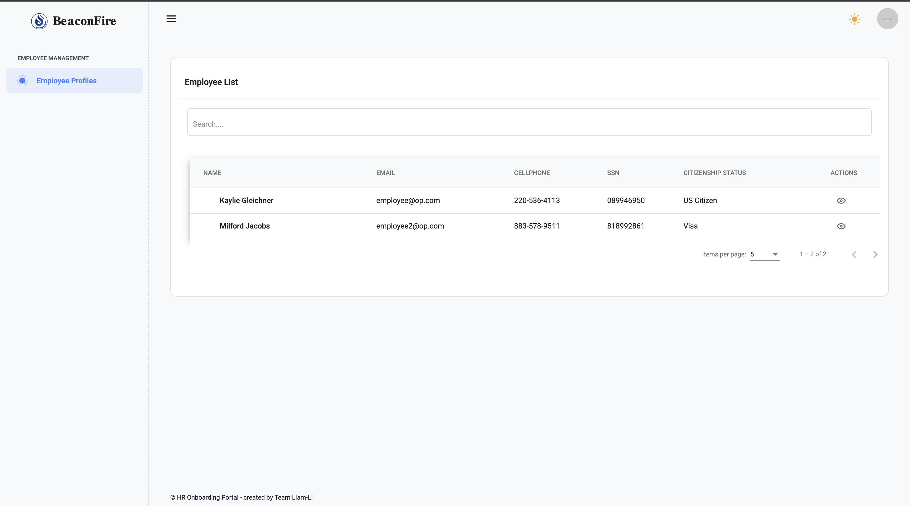
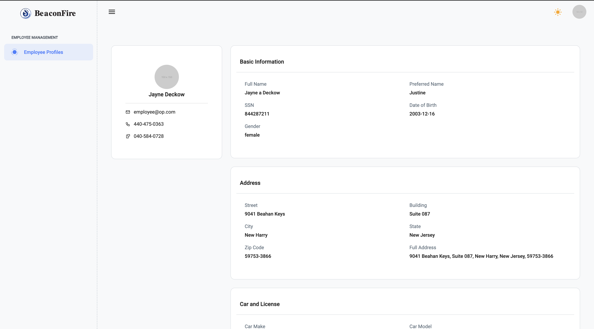
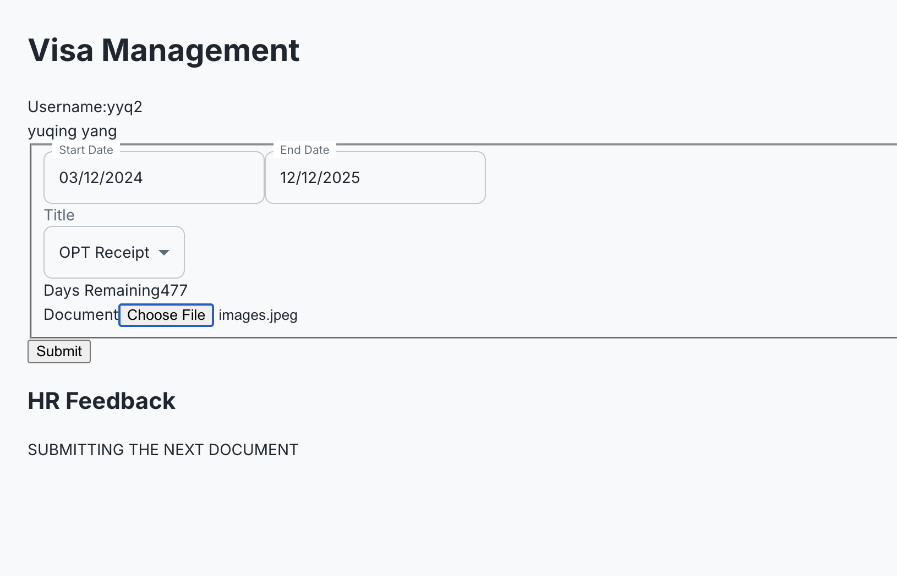
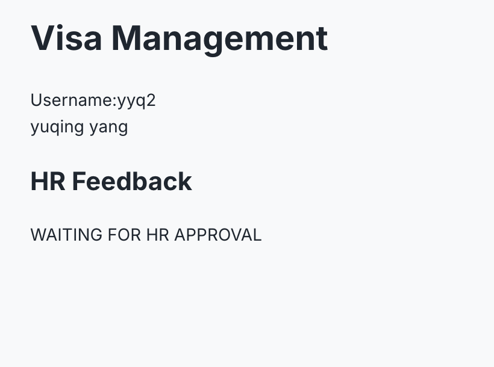

## Team - Progress

## Progress and plan
---
   
### Liam

#### Progress

1. Fix validation bugs in Personal Info page - React
2. Angular - setup
   1. Setup Http interceptor;
   2. Fetch user info when the user first get into the web page
   3. Remove submodules and remove lazy loading from router
3. Auth and login setup
   1. Created Login page
   2. Created auth Ngrx Logic
   3. Created auth Guard
   4. Created Auth Layout
   5. Created Auth Services
4. Employee profiles for HR Portal - Angular - finished
   1. Ngrx logic
   2. API service
   3. UI

#### Plan

1. Testing
2. Coding Checking
3. Fix some theming issues

---

### Yuqing Yang

#### Progress:

1. started angular visa management component

#### Plan:
1. try to finish angular + react front end
test apis

#### Blockers:

CORS - solved
seeder for employee data - solved

---

### Nicolas

#### Progress

The React part is done:
   1. Finished the remaining react portal report submitting logic
   2. Finish the logic of the Angular portal - housing and facility report, but no UI yet

#### Plan

1. debug angular portal

---

### Baoshu

#### Progress

1. Finish almost the onboarding part of React
   1. Implement Onboarding API Service
   2. Implement Onboarding Redux Slice
   3. Implement Onboarding Components
   4. Implement Onboarding Routes
   5. Implement API Integration
   6. Add Onboarding to Navigation Menu - Should be removed

#### Plan

1. Finish the testing and validation
2. Start to work on the Angular once React part finished.

---

### Daniel

#### Progress

1. fixed hr logic issue
2. working on employee registration - React

#### Plan

1. Finish up employee registration
2. get started on HR angular part

## Meeting

1. Share the middleware and validation logic for server
2. Share the express-async-handler middleware coding pattern
3. Angular Ngrx sharing
4. Update `.env`
5. CORS issue

## New demo

